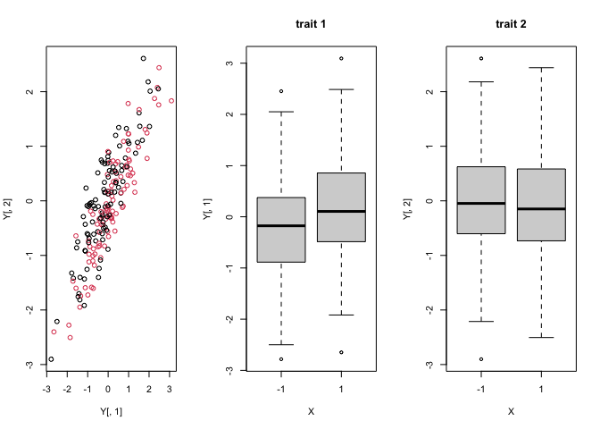

Readme
================

## JointGWAS, a package for multivariate Genome Wide Association Studies

Quick start:

Install the package with:

``` r
devtools::install_github('ucdavis/JointGWAS',ref = 'master')
```

JointGWAS needs a kinship matrix among individuals
(),
and genetic and residual covariance matrices among traits
(
and
).
You also need a data.frame (`data`) with a column identifying the
genotype (`ID`), and a matrix of marker genotypes with rownames of the
the genotype identifiers.

There are two ways to run the joint GWAS. If your trait data are stacked
in a single column (`y`), use `EMMAX_ANOVA`. In this case, `data` also
needs an identifier of each trait (`Trait`).

``` r
cholL_Sigma_inv = make_cholL_Sigma_inv(data,
                                       phenoID='y',rowID='ID',columnID='Trait',
                                       covariances = list(list(Row=K,Column=Ghat),
                                                          list(Column=Rhat))
                                       )
results = EMMAX_ANOVA(formula=y~0+Trait+X:Trait,data,markers,'ID',cholL_Sigma_inv,mc.cores=1,verbose=TRUE)
```

If your trait data are in an

matrix (`Y`), use `EMMAX_ANOVA_matrix`:

``` r
sK = svd(K)
sGR = simultaneous_diagonalize(Ghat,Rhat)
results = EMMAX_ANOVA_matrix(formula=Y~X,data,markers,'ID',svd_matrices = list(sK,sGR),mc.cores = 1,verbose=TRUE)
```

In both cases, `formula` is used to specify the linear model to be fit
for each marker. The term `X` is special and reserved for the genotype
values of a marker, and will be replaced with the genotype values for
each column of `markers` one-by-one. **This means that you cannot have a
column `X`** in `data`. The GWAS functions will extract each term from
`formula` including `X` and do an F-test for that term using R’s `anova`
function.

The output is a list with 3 elements:

-   `anova`: a data.frame with columns giving the MSE, F-statistics and
    p-values for the tests on each term in `formula` including the
    special variable `X`. Each row corresponds to a column of `markers`.

-   `beta_hats`: a matrix of genotype term coefficients. Each column is
    a specific genotype effect (e.g. for one trait).

-   `SEs`: a matrix of standard errors for each column of `beta_hats`.

## Motivation

Here is a simulation to show how a joint test of association of a marker
with **either of two traits** is more powerful than univariate
associations with either trait. In this case, the marker is directly
associated only with trait 1, but traits 1 and 2 are correlated:

    ## [1] "p-values of individual traits"

    ## [1] 0.03256696 0.61433609

<!-- -->

    ## [1] "pvalue of F-test across both traits"

    ## [1] 7.46622e-08

While trait 1 is weakly associated with `X`, the association in the
bi-variate space is much stronger.

## Mathematical Background

A multivariate genetic association test can be specified as:


where:

-   
    is an
    
    matrix of traits

-   
    is an
    
    matrix of covariates (*e.g.* sex, age, environment) with
    
    coefficient matrix
    

-   
    is an
    
    matrix of genotype covariates with
    
    matrix of genotype effects
    ,
    and

-   
    is an
    
    matrix of residual errors.

In a typical univariate GWAS,

is an

vector and

is a scalar, and the GWAS test is against
.
Here we generalize this to tests on **sets of elements of**

being all equal 0. For example, if

is a vector of genotypes and

is a row-vector of genotype effects for each of the
 traits, we could test
against
.

An equivalent formulation of this problem is to work with the vectorized
form of this equation:


where:

-   ")
    is the vector formed by stacking the columns of
    

-   
    is a
    
    matrix of covariates with
    
    coefficient vector
    ")

-   
    is a
    
    matrix of genotype covariates with
    
    coefficient vector
    "),
    and

-   ")

Using this form, we can more flexibly specify

and
.
For example, we could include a main effect for a marker across all
traits, a slope of the marker effects across traits based on a
covariate, and trait-specific deviations from the mean marker effects.

### Accounting for correlated observations *and traits*

In most GWAS applications it is necessary to account for population
structure and general relatedness among the observations using a kinship
matrix. The solution is to include a structured error term:
")
where
,

is an

genomic relationship matrix among the
 observations, and the
two variance components are typically estimated by REML. This is the
typical linear mixed model GWAS.

In the multivariate GWAS context we need to generalize this structured
error term to account for both genomic relationships among observations
and correlations among the
 traits. A multivariate
extension to mixed model GWAS sets

where
")
and
"),
with

and


covariance matrices representing the covariation of the genetic effects
and microenvironmental residuals, respectively.

and

can both be estimated by REML.

### Strategies for computational efficiency in GWAS

Once the estimates of the variance components are available, solutions
and tests for

can by found by generalized least squares. However, the REML solutions
for these parameters are computationally costly. EMMA, FaSTLMM and GEMMA
showed how rotations of the model based on the SVD of

can vastly speed up the calculations of the REML solutions, which makes
exact GWAS solutions possible. GEMMA was extended to multivariate GWAS,
but is limited to a small number of traits and is considerably more
computationally demanding than univariate GEMMA.

Alternatively, EMMAX and GridLMM showed that approximate solutions for
the variance components are generally sufficient for accurate GWAS,
particularly when the effect of any specific marker are small. Using
EMMAX instead of EMMA means finding REML solutions for the variance
components in a reduced model without the

term, and then solving for

conditional on these estimates using generalized least squares. In this
way the variance components do not need to be re-estimated for each
marker. XX proved that EMMAX as a GWAS method is mathematically
equivalent to GBLUP as a genomic prediction method if

for  markers, and the
marker tests and effect sizes can be extracted from the GBLUP solution.

We uses these latter results to perform approximate multivariate linear
mixed model GWAS in **JointGWAS**. Given estimates

and

we find solutions and tests for
").
For computational efficiency we project out

from the model first and return estimates and tests for

only.

## Implementation

As mentioned above, there are two entries into the GWAS functions
depending on whether your data is in matrix or vector form. For the same
number of traits, the matrix function is much faster. However, it is
limited to the case where every trait is measured on every individual.
It is also more limited in the types of models that can be fit - models
where there are main effects of markers across traits are not currently
implemented in the matrix form.

### \``` EMMAX_ANOVA` `` usage

When each trait is measured on a subset of the individuals (or some
trait:individual combinations are missing), \``` EMMAX_ANOVA` `` must be
used. This is the “long-form” model with trait values stacked in a
single column vector.

Start by setting up a data.frame with at minimum a column to identify
the genotype (`genoypeID`) and a column to identify the trait (`Trait`).
You can include other covariates that you would like, for example
covariates that differ among the genotypes, among the traits (e.g. if
traits are yield in different trials, you could include covariates to
describe the trial conditions), and covariates that differ among the
observations.

Now, write the model formula for the long-form data. This should include
a term for `Trait`, and a term for marker effects for each trait:
`X:Trait`. Optionally you can include the other covariates and
covariate:marker interactions. The simplest model would be:

`y~Trait+X:Trait`

**Note:** Remember that `X` is a special term that can only refer to
columns of the marker matrix.

Prepare your marker data in a matrix with individuals as rows and
markers as columns. If you include column names, these will be included
in the output. Row names are required and much include all levels of
`data[[genotypeID]]`. Note: the marker matrix should have one row for
each genotype, even if a genotype is present in multiple rows of `data`.

Before running the GWAS, we have to prepare the error term. Typically we
have a single kinship matrix

with a corresponding genetic covariance matrix

and a residual covariance matrix
.
With these, we combine them into the full covariance matrix

using the function `make_cholL_Sigma()` :

``` r
cholL_Sigma_inv = make_cholL_Sigma_inv(data,
                                       phenoID='y',rowID='ID',columnID='Trait',
                                       covariances = list(list(Row=K,Column=Ghat),
                                                          list(Column=Rhat))
                                       )
```

To run this function, we pass our long-form data matrix which includes
the phenotype column, the columns of `data` identifying genotypes (here
called `rowID`) and traits (here called `columnID` and paired lists of
matrices specifying components of the overall covariance. In our typical
case we have 2 components, the pair
()
and the pair ($\\mathbf{I},\\mathbf{R}$), but it is possible to include
more pairs if needed. Note: if either the Row or Column argument of a
pair is missing it is assumed to be the identity matrix.

Finally, we can run the GWAS by passing these arguments to the
`EMMAX_ANOVA` function:

``` r
results = EMMAX_ANOVA(formula=y~Trait+X:Trait,data,markers,'ID',cholL_Sigma_inv,mc.cores=1,verbose=TRUE)
```

The `mc.cores` argument allows the tests to be parallelized over
processor cores.

### `EMMAX_ANOVA_matrix` usage

When every trait is measured on every subject, the phenotype data can be
arranged into a

matrix with no missing values. In this case we can use more efficient
calculations.

Start by setting up a data.frame with at minimum a column to identify
the genotype (`genoypeID`). Note: there will be no column for trait here
because this data.frame describes the characteristics of each genotype,
not each trait.

Form the data into a matrix `Y` with rows corresponding to the rows of
`data`, and columns as traits. It is also possible to incorporate `Y`
into `data` and refer to the trait matrix with its trait names in the
formula as `cbind(trait1,trait2,trait3)`.

Write the model formula *that applies individually to each trait*. If
you have covariates that describe the genotypes, include these terms.
Also include a term for the marker effect on a trait. The simplest model
would be:

`Y~X`

**Note:** Remember that `X` is a special term that can only refer to
columns of the marker matrix.

Prepare your marker data in a matrix with individuals as rows and
markers as columns. If you include column names, these will be included
in the output. Row names are required and much include all levels of
`data[[genotypeID]]`. Note: the marker matrix should have one row for
each genotype, even if a genotype is present in multiple rows of `data`.

Before running the GWAS, we have to prepare the error term. Typically we
have a single kinship matrix

with a corresponding genetic covariance matrix

and a residual covariance matrix
.
We prepare the error term by taking the singular value decompositions of
the row and column matrices separately. **Note**: This only works with
two variance components (K + I).

``` r
sK = simultaneous_diagonalize(K,diag(1,nrow(data))) # could be replaced with svd(K)
sGR = simultaneous_diagonalize(Ghat,Rhat)
```

Finally, we can run the GWAS by passing these arguments to the
`EMMAX_ANOVA_matrix` function:

``` r
results = EMMAX_ANOVA_matrix(formula=Y~X,data,markers,'ID',svd_matrices = list(sK,sGR),mc.cores = 1,verbose=TRUE)
```

There is one additional optional argument for
\``` EMMAX_ANOVA_matrix` ``: `cis_markers`. This is an argument
specifically for eQTL analyses where for specific markers you can remove
specific traits from the overall F-test of joint marker effects. Since
cis-eQTL are so common, if a marker is in cis to one of the genes in
`Y`, a significiant F-test for the association between this marker and
*any gene in `Y`* is not particularly interesting because it is likely
just a cis effect on the local gene. But we may still want to know if
this marker is a QTL for *any other gene in `Y`*. In this case we can
simply pull out the nearby gene(s) from the F-test and perform the test
between the marker and the remaining genes (accounting for covariances
among all genes in `Y`). `cis_markers` is a list with `p` elements where
the `ith` element is a vector of columns of `Y` that should be removed
from the F-test for marker `i`. In this case, the F-test for this marker
will have fewer numerator degrees of freedom. The coefficients for the
remaining columns of `Y` will be tested last by `anova` using R’s
default Type I SSs.
